# working models
----
# table of framework and language

## Working methods
### all() method
- 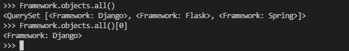
### filter method
- 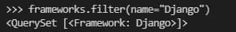
### name
- 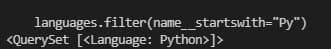
### relation
- 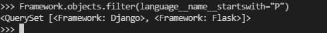
### command for musician table
- 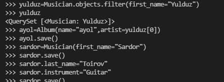
### command for album table
- 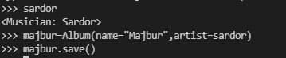

### musician table
- 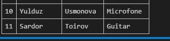
### album table
- 

### choices
- 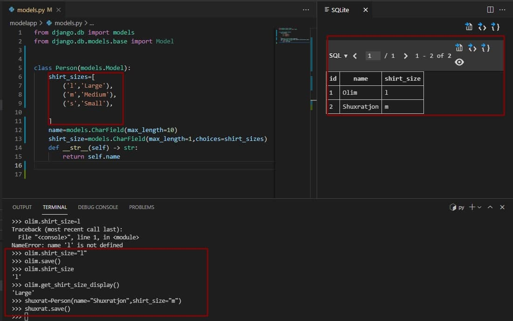

### create method
**create method for creating an object and saving it all one step**
- 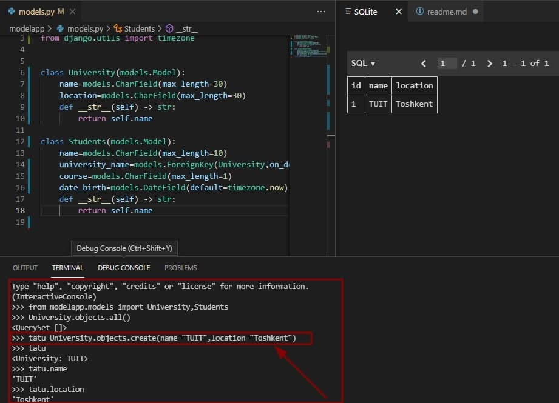
### deleting object

**delete() method delete teble's object and objects**
- 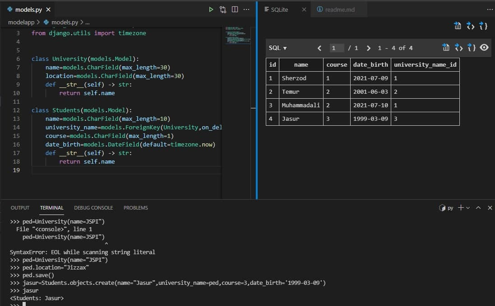
- 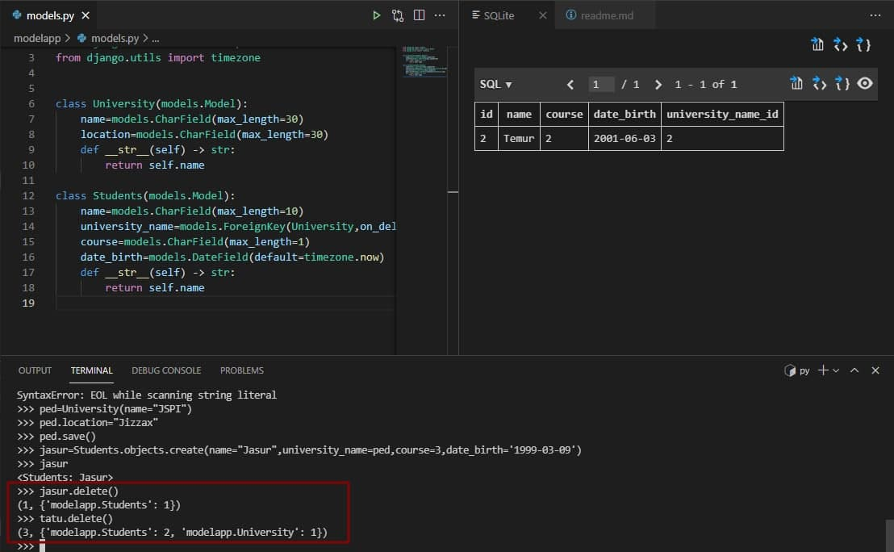